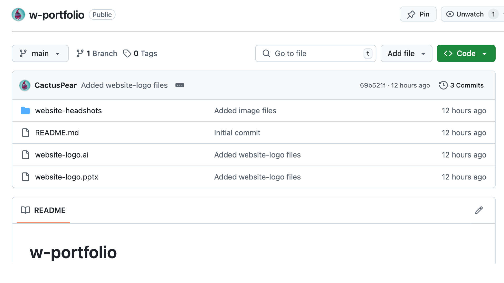

# Portfolio Workshop

Here you'll find all the files and links you'll need for the workshop.

:exclamation: Make sure to download them by selecting the green **< > Code** button, then select the **Download ZIP** button.

## 1 - Workshop Files

- **Folder:** website-logos

  - Includes :one: example logos, :two: an Adobe Illustrator file and PPT file to create your logo and favicon)

- **Folder:** website-headshots

  - Includes 24 ChatGPT generated images
 
- **PDF:** how-to-export-logos

  - Includes instructions with images on how to export your logo from Adobe Illustrator and Power Point.

- **PDF:** portfolio-resources

  - Includes :one: links to colour palette tools, :two: links to domain name registrars, :three: links to real world portfolios, and :four: links to Google Sites resources

- **PDF:** workshop-ppt

  - Includes slides with visual on topics covered in the workshop
 

## 2 - Website Demo

- [Cassie Rousseau's Website Portfolio](https://sites.google.com/view/cassierousseau/)
 

## 3 - Website Branding

- Check out brand colours and colour trends:

  - [Intro to Brand Colors: The Ultimate Guide for Businesses](https://looka.com/blog/brand-colors/)
  
  - [Top 6 Color Trends of 2025 + Color Inspiration](https://looka.com/blog/logo-color-trends/)
  
- Find a colour palette:

  - [Coolors](https://coolors.co/)
  
  - [Adobe Color](https://color.adobe.com/)
  
- Check if a colour palette is colorblind-safe:
  
  - [Coloring for Colorblindness](https://davidmathlogic.com/colorblind/#%23D81B60-%231E88E5-%23FFC107-%23004D40)

  - [Chroma.js Color Palette Helper](https://www.vis4.net/palettes/#/9|s|00429d,96ffea,ffffe0|ffffe0,ff005e,93003a|1|1)
 

  ## 4 - Domain Name Registrars

- [Squarespace](https://domains.squarespace.com/)

- [GoDaddy](https://www.godaddy.com/en-ca)
  
- [Namcheap](https://www.namecheap.com/)
  
- [Hostinger](https://www.hostinger.com/domain-name-search)
 

  ## 5 - Real World Portfolios

- Instructional designers:

  - [Cath Ellis](https://www.cathellis.com/)

  - [Katherine Porter](https://kporterlxd.com/)

  - [Vanessa Miller](https://www.vvmiller.com/)

  - [Sean Anderson](https://www.seanandersonlxd.com/)

  - [Shelby Kandziora](https://www.shelbykdesign.com/)

  - [David Leisey](https://www.davidleisey.com/)

  - [Sabrina Gonzales](https://www.sabrinaglxd.com/)

  - [Amanda Nguyen](https://www.amandalxd.com/)

  - [Ashi Tandon](https://www.ashitandon.com/)

  - [Courtney Roberts](https://www.cmrobertsdesigns.com/)

  - [Gokcenur Inan](https://www.gokcenurlxd.com/)

  - [Kari Edmonds](https://www.kariedmonds.com/blog)

  - [Kate Golomshtok](https://rise.articulate.com/share/pMncp-QSH19CzWogfzXVukBnWw7DbAc9#/) (Articulate Rise)

  - [Lee Hippolite](https://www.leehippolite.com/)

  - [Wrenn Corcoran](https://www.wrenncorcoran.com/)

- Other designers (for fun):

  - [Ivette Felix Uy](https://www.ivettefelixuy.com/)

  - [Colin Moy](https://colin-moy.webflow.io/#portfolio)

  - [John Carter](https://youtemplate.webflow.io/home)
 

  ## 6 - Google Sites Resources

- [Get started with Sites in Google Workspace](https://support.google.com/a/users/answer/9314941?sjid=5419446473116317702-NA)

- [Google Sites cheat sheet](https://support.google.com/a/users/answer/9300023?sjid=5419446473116317702-NA)
